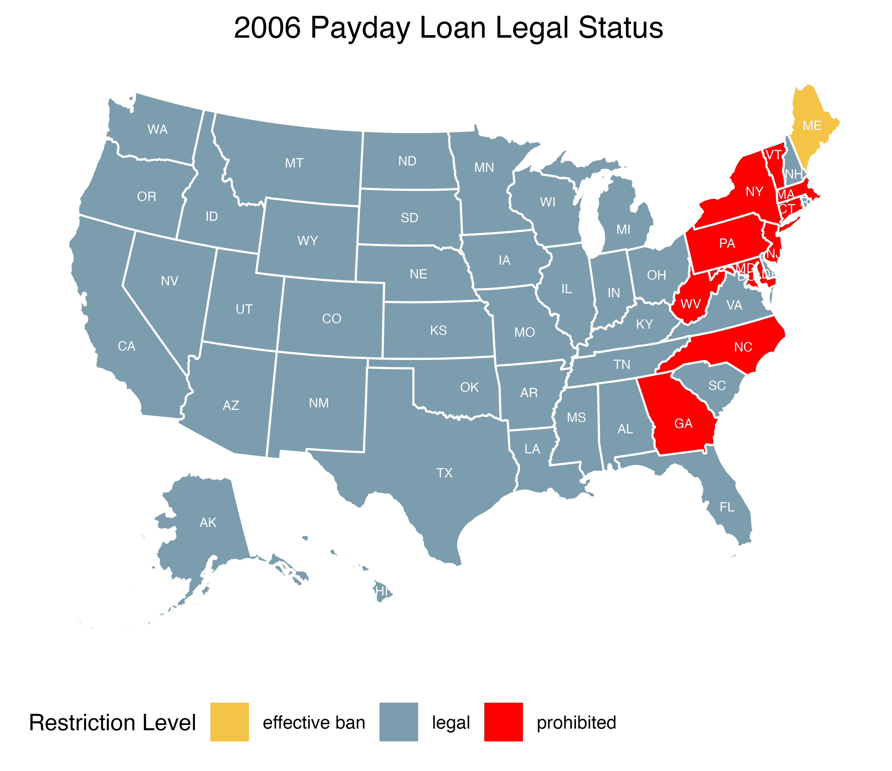
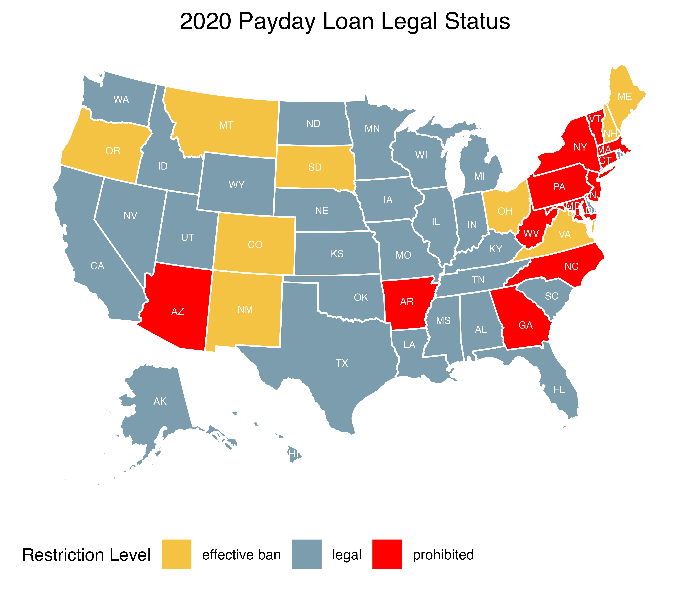

# Map: Payday Loan Legal Status in the US 

## Data source
1. Payday loan legal status
	* (1) [Market Snapshot: Consumer use of State payday loan extended payment plans](https://files.consumerfinance.gov/f/documents/cfpb_market-snapshot-payday-loan-extended-payment-plan_report_2022-04.pdf)
	* (2) Each state's legislative payday loan clauses
2. Payday loan text analysis 
	* Payday loan product descriptions from 11 largest payday loan lenders’ websites in the US. These payday lenders are Ace Cash Express, Advance America, Cash Central, Cash Store, Check City, Check into Cash, Check n’ Go, DirectPaydayLoans, Money Tree-California, My Payday Loan, Oasis Payday Loans, and PaydayChampion.

## About this project 
* This project entails the depiction of the legal status of payday loans across the United States, individually assessed for the years 2006 and 2020, thereby providing a comprehensive comparative analysis.
* It also examines online advertising strategies employed by payday lenders.

## Methodology
* Payday lending regulations are classified into three categories, primarily determined by the annual percentage rate (APR). States where there are no restrictions on the APR fall under the "legal" category. Conversely, states imposing an APR cap of approximately 45% are designated as "effective ban" states, as such a limit makes it unsustainable for lenders to operate profitably. Finally, states explicitly prohibiting payday loans are categorized as "prohibited" states.
* For text data, most special characters (such as `%`, and `:`) are removed in the data. To ensure consistency of the data analysis:  (i) The key plural nouns formatted as singular words;  (ii) The key verbs are formatted in original forms; (iii) Some terms are grouped together for analysis purposes (such as "Business Day").

## Figures

* Top 45 most used words by payday lenders on their websites
